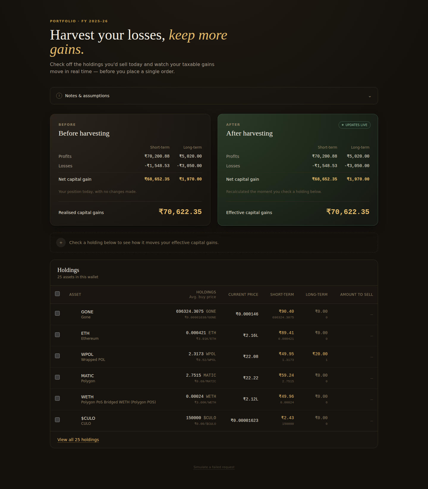
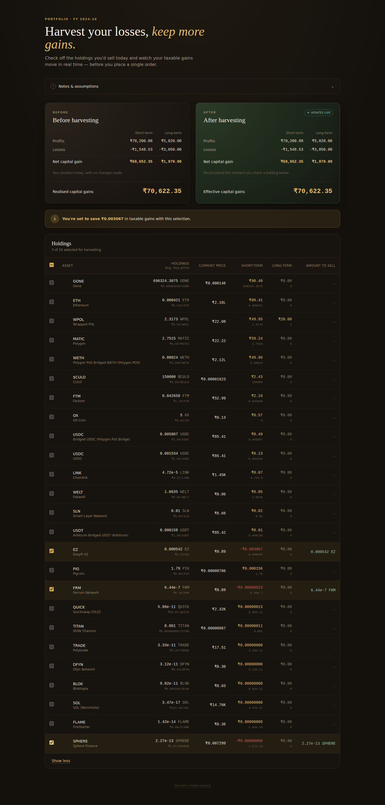
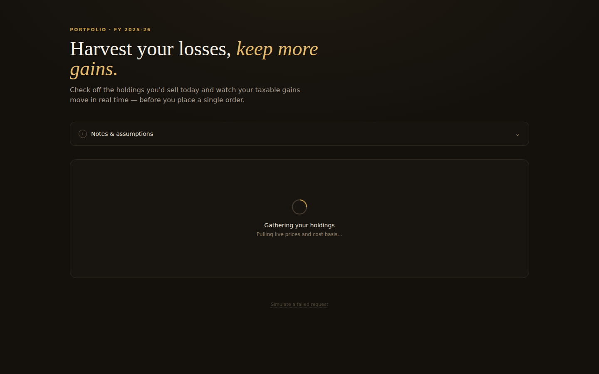
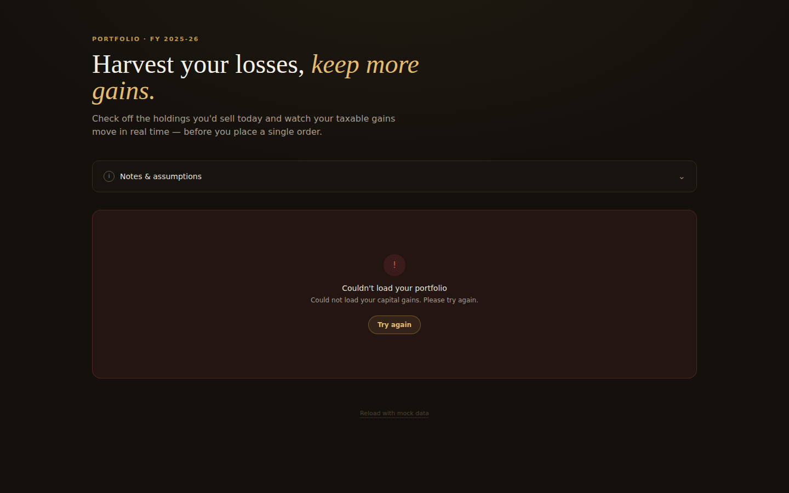
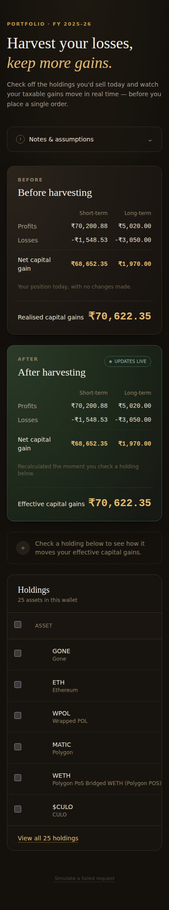

# Harvest — Tax Loss Harvesting Tool

A responsive React tool for previewing how selling specific crypto holdings today would change this year's capital gains tax bill, before placing a single order.

Built for the Tax Loss Harvesting assignment. The UI's visual identity (palette, type, layout) is an original design rather than a copy of the reference walkthrough — the calculation logic and interaction flow follow the brief exactly.



## Live preview

An interactive, non-installed preview of this same interface is available directly in the Claude conversation this project was generated from (see the accompanying artifact). To run the real thing locally or deploy it, follow **Setup** below.

## Setup

Requires Node.js 18+.

```bash
npm install
npm run dev       # starts a dev server at http://localhost:5173
```

Other scripts:

```bash
npm run build      # type-checks and builds a production bundle to dist/
npm run preview    # serves the production build locally
```

### Deploying

The build output is a static site (`dist/`), so any static host works:

```bash
npm run build
npx vercel --prod          # Vercel
# or drag-and-drop the dist/ folder onto netlify.com/drop
```

## How it's organised

```
src/
├── api/                 # Mock "network" layer
│   ├── holdingsApi.ts        Promise + setTimeout wrapper around the fixture
│   ├── capitalGainsApi.ts    Same pattern for capital gains totals
│   └── holdings-fixture.ts   The 25-asset dummy dataset from the brief
├── context/
│   └── HarvestingContext.tsx  Single source of truth: fetch status, holdings,
│                               selection state, and every derived total
├── components/
│   ├── Header.tsx            Page intro
│   ├── SummaryCard.tsx       Before/After capital gains card (one component,
│   │                          driven by props — not two near-duplicate cards)
│   ├── SavingsBanner.tsx     The conditional "you're set to save ₹X" message
│   ├── HoldingsTable.tsx     Table shell, select-all, sort, "View all"
│   ├── HoldingRow.tsx        One row: checkbox, asset, prices, gains
│   ├── Loader.tsx            Loading skeleton
│   └── ErrorState.tsx        Error + retry
├── utils/
│   ├── calculations.ts       All the math (pure functions, unit-testable)
│   └── format.ts             Currency/quantity formatting
└── types/index.ts            Shared TypeScript types
```

State management is `useContext` + `useReducer`-style hooks (no external state
library) — the derived numbers (net gains, realised totals, savings) are computed
with `useMemo` from two small pieces of state: the fetched data and the set of
selected holding IDs. Selecting a row never mutates the original API response;
`applyHarvestSelection` returns a new object every time.

## The calculation, in one place

`src/utils/calculations.ts`:

```ts
netShortTerm = stcg.profits - stcg.losses
netLongTerm  = ltcg.profits - ltcg.losses
realised     = netShortTerm + netLongTerm

// For each selected holding:
//   gain > 0  → add to that bucket's profits
//   gain < 0  → add |gain| to that bucket's losses
//   gain = 0  → no effect
```

This matches the worked example in the brief exactly — selecting a holding with
a short-term gain of ₹500 and a long-term loss of ₹1,000 against a starting
`{ stcg: {100, 500}, ltcg: {1200, 100} }` produces the same `{600,500}` /
`{1200,1100}` result and the same ₹700 → ₹200 drop described there.

The "You're set to save ₹X" banner appears exactly when
`preHarvest.realised > postHarvest.realised`, per the spec.

## Screenshots

| | |
|---|---|
|  |  |
|  |  |

## Assumptions

- **Mock APIs.** Both endpoints are Promises resolving fixture data after a
  simulated delay (900ms / 700ms) — there's no real backend, per the brief's
  own suggestion. A "Simulate a failed request" link in the footer re-fetches
  with a forced rejection, to exercise the error/retry path on demand.
- **Savings figure is a rupee delta, not a tax calculation.** "You're set to
  save ₹X" reports the drop in *realised capital gains* between the two
  cards. It isn't run through a tax slab or rate — the brief doesn't specify
  one, and showing the raw reduction avoids implying a rate that may not
  match the reader's actual bracket.
- **"Amount to sell" is all-or-nothing.** Checking a row assumes a full exit
  from that holding (`totalHolding`); there's no partial-quantity input,
  since the brief's table spec doesn't call for one.
- **Row order.** Holdings are sorted by the combined size of their short- and
  long-term gain/loss (largest first), so the assets most worth reviewing
  surface at the top. Column-header sorting wasn't in scope.
- **Stable row identity.** A couple of fixture rows share a `coin` symbol
  (e.g. two different USDC entries), so each holding gets a synthetic `id`
  at fetch time rather than being keyed by `coin`.
- **Dust-level entries.** A few fixture rows carry gains on the order of
  `1e-10`–`1e-16` (floating-point remainders in the source data). These
  round to ₹0.00 in the table but keep the correct profit/loss sign for
  coloring — they're immaterial by design, not a display bug.
- **Currency formatting.** Large values use hand-rolled Indian-numbering
  suffixes (K / L / Cr) rather than `Intl.NumberFormat`'s built-in `compact`
  notation — that API renders `en-IN` thousands as `"T"` in some browser
  engines, which reads as "trillion" and is a real mislabelling risk in a
  tax tool.

## Bonus items implemented

- Mobile responsive (cards stack under `lg`, table scrolls horizontally)
- Reusable, prop-driven components (one `SummaryCard`, not two)
- Centralised state via Context, with all totals derived (nothing duplicated)
- Visual feedback on selection (row highlight, animated "live" badge on the
  After card)
- Loading skeleton and error/retry states for both mocked endpoints
- "View all" expansion in the holdings table
